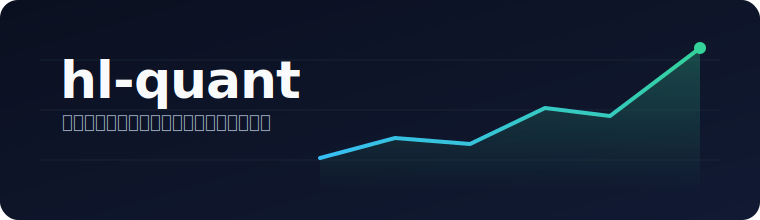

<div align="center">



### 把量化研究压缩成「一个可编辑的策略 + 一个固定的打分器」，再用启发式学习持续把分数推高。

中文 · [English (TODO)](README.md)

[](LICENSE)
[](https://github.com/toddwyl/hl-quant/stargazers)
[](skills/hl-quant/SKILL.md)
[](https://www.joinquant.com/help/api/doc?name=JQDatadoc)

[What is this](#what-is-this) · [快速开始](#快速开始) · [How it works](#how-it-works) · [安装 Skills](#安装-skills) · [微信交流群](#微信交流群) · [Star History](#star-history)

</div>

---

## What is this

`hl-quant` 把 Jiayi Weng 的 [Heuristic Learning](https://trinkle23897.github.io/learning-beyond-gradients/) 框架和 Andrej Karpathy 的 [auto-research](https://github.com/karpathy/autoresearch) 范式，落到**量化交易策略优化**这件具体的事上。

它是一个**最小化**的范例：把量化策略的研究流程，提炼成「**一个可编辑的策略 + 一个固定的回测打分器**」两件东西，再用启发式学习（Heuristic Learning / 启发式探索）一轮轮把分数推高。

思路源自一套真实的小微盘量化系统（`quant_trader`），这里只抽出它最核心的两个器官，去掉所有工程脚手架，让**范式本身一眼可见**。

## 核心范式：固定评估器 + 单一可编辑程序

```
        ┌─────────────────┐   改它      ┌──────────────────┐
  HL →  │   strategy.py   │ ──────────▶ │   backtest.py    │ ──▶  一个分数
        │  唯一可编辑程序  │   只读它     │   固定评估器      │      (score)
        └─────────────────┘            └──────────────────┘
```

- **`strategy.py`** —— 策略的唯一语义源。启发式学习**只允许改这一个文件**：提假设、改逻辑、调参数。
- **`backtest.py`** —— 固定的评估口径。拉数据、模拟成交、算指标、输出**单一分数**。一旦固定就**不许动**——否则「改了评估器把分数刷上去」，候选之间不再可比。

每个候选策略都用同一条命令、同一段数据、同一个评分公式打分，于是「这版到底有没有更好」变成一个可排序的客观问题。

评分口径采用 **Sortino ratio（索提诺比率）**，把一条策略的下行风险调整后收益压成一个标量：

```
score = Sortino
```

> [!NOTE]
> 范式背后的完整设计见 [`docs/design/heuristic-exploration-framework.md`](docs/design/heuristic-exploration-framework.md)。

## 快速开始

<details>
<summary>🔑 配置数据凭证</summary>

回测数据来自[聚宽 JQData](https://www.joinquant.com/help/api/doc?name=JQDatadoc)。不要把账号密码写进代码或提交进仓库，用环境变量传入：

```bash
export JOINQUANT_ACCOUNT=<你的聚宽账号>
export JOINQUANT_PASSWORD=<你的聚宽密码>
```

</details>

<details>
<summary>📦 安装依赖</summary>

建议用虚拟环境，按 `requirements.txt` 自行安装：

```bash
python3 -m venv .venv
source .venv/bin/activate          # Windows: .venv\Scripts\activate
pip install -r requirements.txt
```

</details>

<details>
<summary>▶️ 跑一次回测</summary>

```bash
cd example
python backtest.py
```

</details>

## How it works

<details>
<summary>🧭 HL 循环</summary>

启发式学习是一个结构化的推理循环——每一轮提一个**有经济含义**的假设，只改策略文件，用固定评估器打分，**严格更好才留**：

```
Probe（跑基线）→ Diagnose（看弱点）→ Propose（提一个有经济含义的假设）
   → Patch（只改 strategy.py）→ Evaluate（固定评估器打分）→ Decide（严格更好才留）
```

两条硬规矩：

1. **只改 `strategy.py`**，评估器 / 数据源 / 评分公式一律不动。
2. **严格更好才算数**——分数没有严格高于基线的候选，不予保留；窄区间死区式的过拟合（在连续变量上挖 1~2 点宽的坑）一律拒绝。

</details>

<details>
<summary>📈 演示：HL trial ledger</summary>

按 [`skills/hl-quant/SKILL.md`](skills/hl-quant/SKILL.md) 的纪律跑：固定评估器不动，只改 `strategy.py`，每轮留下证据、判断和决策。

固定命令：

```bash
cd example
python backtest.py
```

本轮回测标的为上证指数（`000001.XSHG`），区间 `2025-03-01 ~ 2026-02-28`，同期买入持有约 **+25.50%**。

| HL 步骤 | 证据 | 判断 | 动作 |
| --- | --- | --- | --- |
| **Probe** | 基线 5/10：score 0.7545，总收益 +5.46%，胜率 41.67%，12 笔交易 | 只吃到指数涨幅的一小段，交易多但质量低 | 保持评估器不动，进入诊断 |
| **Diagnose** | 12 笔交易、胜率低、收益远低于买入持有 | 5/10 均线太灵敏，震荡里频繁翻转、过早离场 | 聚焦“均线灵敏度”这一变量 |
| **Propose** | 趋势行情里，放慢均线通常能过滤日间噪声 | 把 5/10 放慢到 10/20 有经济含义，不是窄区间挖坑 | 只提出这一处参数变化 |
| **Patch** | `strategy.py` 是唯一可编辑程序 | 评估器、数据源、评分公式不动 | `SHORT_WINDOW: 5 → 10`，`LONG_WINDOW: 10 → 20` |
| **Evaluate** | 10/20：score 2.0615，总收益 +17.33%，胜率 57.14%，7 笔交易 | 分数严格提高，收益、Sharpe、回撤、胜率同步改善 | 候选进入接受检查 |
| **Replay** | 10/30、20/60 分数更高，但只剩 2 笔 / 1 笔交易 | 样本量过小，像撞上这段行情 | 拒绝追最高分 |
| **Decide** | 10/20 分数更高且交易笔数仍可接受 | 改进可信度高于 10/30、20/60 | **接受 10/20** |

实际补丁只有两个参数：

```python
SHORT_WINDOW = 10   # 基线 5
LONG_WINDOW = 20    # 基线 10
```

固定评估器重跑输出：

```
参数  SHORT_WINDOW=10  LONG_WINDOW=20
------------------------------------------------
  总收益     : +17.33%
  年化收益   : +18.19%
  Sharpe     : 1.839
  Sortino    : 2.062
  最大回撤   : 6.71%
  胜率       : 57.14%  (7 笔)
------------------------------------------------
  >>> SCORE  : 2.0615
```

候选证据表：

| 候选 | Score / Sortino | 总收益 | Sharpe | 最大回撤 | 胜率 | 交易笔数 | 决策 |
| --- | ---: | ---: | ---: | ---: | ---: | ---: | --- |
| 5/10 基线 | 0.7545 | +5.46% | 0.698 | 7.10% | 41.67% | 12 | 基线 |
| 10/20 | 2.0615 | +17.33% | 1.839 | 6.71% | 57.14% | 7 | 接受 |
| 10/30 | 2.2579 | +19.24% | 2.017 | 4.94% | 100.00% | 2 | 拒绝：样本太少 |
| 20/60 | 2.0898 | +17.93% | 1.915 | 5.01% | 100.00% | 1 | 拒绝：样本太少 |

</details>

## 安装 Skills

上面这套循环已经打包成一个可复用的 [Agent Skill](skills/hl-quant/SKILL.md)，用 [`npx skills`](https://github.com/vercel-labs/skills) 一键安装到你自己的 agent（Claude Code / Cursor 等）：

```bash
npx skills add toddwyl/hl-quant
```

装好后，跟 agent 说「用启发式探索优化这个策略」就会触发它，按 `Probe → Diagnose → Propose → Patch → Evaluate → Decide` 的纪律帮你迭代——只改策略文件、严格门槛、反过拟合。

## 仓库结构

```
hl-quant/
├── README.md
├── requirements.txt    # pip 依赖（仓库不附带任何虚拟环境）
├── example/
│   ├── strategy.py     # 唯一可编辑程序（HL 改这里）
│   └── backtest.py     # 固定评估器（拉聚宽数据 → 模拟 → 打分）
├── skills/
│   └── hl-quant/SKILL.md            # 可 npx 安装的启发式探索 skill
└── docs/
    └── design/heuristic-exploration-framework.md   # 范式背后的完整设计
```

## 微信交流群

面向中文用户的微信交流群（**WeChat group for Chinese-speaking users**）。扫码加入，一起讨论启发式学习、量化策略与 Agent 工作流：

<div align="center">

</div>

> [!NOTE]
> 二维码图片请放在 `docs/images/wechat-group.jpg`（群二维码会定期更新；若已过期，欢迎在 Issues 留言）。

## Star History

<a href="https://star-history.com/#toddwyl/hl-quant&Date">
  <picture>
    <source media="(prefers-color-scheme: dark)" srcset="https://api.star-history.com/svg?repos=toddwyl/hl-quant&type=Date&theme=dark" />
    <source media="(prefers-color-scheme: light)" srcset="https://api.star-history.com/svg?repos=toddwyl/hl-quant&type=Date" />
    
  </picture>
</a>

## References

Weng, J. (2026). *Learning Beyond Gradients*. https://trinkle23897.github.io/learning-beyond-gradients/

Karpathy, A. (2025). *auto-research*. https://github.com/karpathy/autoresearch
